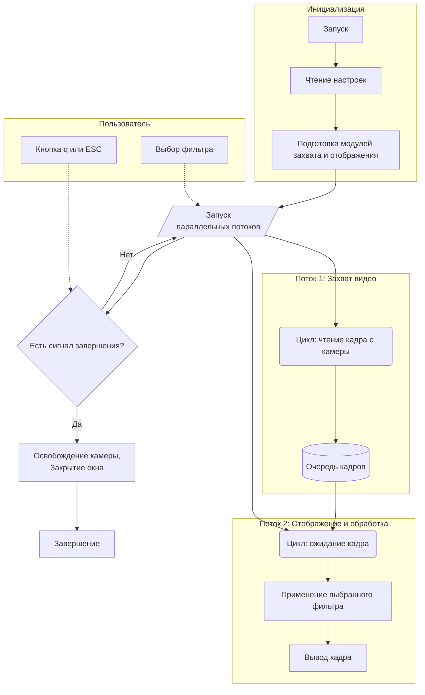

# Video Capture Application

Проект, который реализовывает захват видеопотока с камеры, применяет фильтры в реальном времени и отображает обработанные кадры..

Кадры помещаются в очередь, чтобы разделить процессы захвата и обработки/отображения кадров. Это позволяет:  
- Захватывать кадры с камеры с нужной частотой, не дожидаясь обработки предыдущего кадра.
- Передавать кадры между потоками: один поток захватывает и кладёт в очередь, другой — берёт из очереди и отображает/обрабатывает.
- Избежать потери актуальных кадров, если обработка временно задерживается.

Без очереди, если обработка кадра занимает больше времени, чем захват, новые кадры будут теряться и тормозить.

Используется время ожидания, чтобы частота захвата кадров соответствовала заданному FPS из настроек. 
Если обработка кадра заняла меньше времени, чем требуется для одного кадра при текущем FPS, 
программа "доспит" оставшееся время. Это предотвращает избыточную нагрузку на процессор и обеспечивает 
стабильную частоту кадров, чтобы видео не шло быстрее, чем нужно

Если FPS в настройках указано выше, чем реально возможная скорость обработки кадров, то кадры будут захватываться 
и обрабатываться так быстро, как позволяет система (FPS будет ниже заданного)

## Возможности

- **Многопоточная архитектура:** Захват видео и его отображение выполняются в отдельных потоках
- **Фильтры в реальном времени:** Примяет фильтры:
  - `none` — без фильтра
  - `blur` — размытие по Гауссу
  - `brightness` — повышение яркости 
  - `sharpen` — увеличение резкости
- **Управление через конфигурацию:** Все параметры настраиваются через файл `.env`
- **Корректное завершение:** Приложение закрывается по команде (нажатие 'q' или ESC) или по системному сигналу (Ctrl+C)
- **Надежная обработка ошибок:** Пользовательские исключения
- **Подробное логирование:** Логирование с помощью `loguru`

Информация по фильтрам:
- `blur` реализован через `cv2.GaussianBlur()` с ядром 5x5 и стандартным отклонением 0
- `sharpen` реализован через `filter2D()` c ядром, повышающим резкость
- `brightness` реализован через `cv2.convertScaleAbs()` с коэффициентом альфа и смещением

Cсылки на документацию:
- [blur](https://gregorkovalcik.github.io/opencv_contrib/tutorial_py_filtering.html)
- [sharpen](https://docs.opencv.org/4.x/d4/d86/group__imgproc__filter.html#gaa0c7b8f1d2e3f5b6c9d8c1e0f3b2f5a7)
- [brightness](https://docs.opencv.org/4.x/d3/dc1/tutorial_basic_linear_transform.html)


## Структура проекта

Структура внутри каталога `src/` модульная

```
video_capture_app/
├── src/
│   ├── main.py
│   ├── config.py               # Загрузка и валидация конфигурации
│   ├── exceptions.py           # Пользовательские исключения
│   ├── camera/                 # Логика захвата с камеры
│   │   ├── capture.py
│   │   └── manager.py
│   ├── filters/                # Реализации фильтров изображений
│   │   ├── base.py
│   │   ├── blur.py
│   │   ├── sharpen.py
│   │   └── brightness.py
│   ├── display/                # Логика отображения видео
│   │   └── window.py
│   └── utils/                  # Вспомогательные модули (логирование)
│       └── logger.py
├── tests/
│   ├── conftest.py
│   └── integration/            # Интеграционные тесты для потока
│       └── test_application.py
├── .env.example                # Пример конфигурации окружения
├── .gitignore
├── requirements.txt            # Зависимости
├── pytest.ini                  # Конфигурация тестов
└── README.md
```

## Архитектура

Архитектура приложения построена вокруг двух основных потоков, которые обмениваются данными через общую очередь



## Установка

1.  **Клонирование репозитория:**
    ```bash
    git clone https://github.com/DalekTek/video_capture_app.git
    cd video_capture_app
    ```

2.  **Создание виртуального окружения:**
    ```bash
    python -m venv venv
    venv\Scripts\activate
    ```

3.  **Установка зависимостей:**
    ```bash
    pip install -r requirements.txt
    ```

## Настройки

Приложение настраивается с помощью файла `.env`. Создайте файл `.env` в корне проекта, скопировав пример из `.env.example`

Отредактируйте файл `.env` в соответствии с системными настройками и предпочтениями.

| Переменная          | Описание                                                | Значение по умолчанию          |
|---------------------|---------------------------------------------------------|--------------------------------|
| `CAMERA_INDEX`      | Индекс устройства камеры (например, по умолчанию)       | `0`                            |
| `FRAME_WIDTH`       | Желаемая ширина кадра с камеры                          | `640`                          |
| `FRAME_HEIGHT`      | Желаемая высота кадра с камеры                          | `480`                          |
| `FPS`               | Целевая частота кадров для захвата                      | `30`                           |
| `WINDOW_TITLE`      | Заголовок окна отображения                              | `Video Capture`                |
| `DISPLAY_SCALE`     | Множитель для масштабирования размера окна              | `1.0`                          |
| `DEFAULT_FILTER`    | Фильтр, применяемый при запуске (`none`, `blur` и т.д.) | `none`                         |
| `FILTER_INTENSITY`  | Интенсивность фильтра (от `0.0` до `1.0`)               | `0.5`                          |
| `AVAILABLE_FILTERS` | Список доступных фильтров, разделенных запятыми         | `none,blur,sharpen,brightness` |
| `MAX_QUEUE_SIZE`    | Максимальное количество кадров в буфере                 | `10`                           |
| `LOG_LEVEL`         | Уровень логирования (например, `DEBUG`, `INFO`)         | `DEBUG`                        |

### Добавление новых фильтров  

Чтобы добавить новый фильтр:  
1. Создайте модуль с именем фильтра в папке `src/filters/` (например, `contrast.py` для фильтра `contrast`).
2. Реализуйте в нём класс фильтра, унаследованный от `BaseFilter`, и зарегистрируйте его через `FilterFactory.register`.
3. Добавьте имя фильтра в переменную `AVAILABLE_FILTERS` в `.env` 
   (например, `AVAILABLE_FILTERS=none,blur,brightness,sharpen,contrast`).
4. Добавьте обработку клавиши для переключения на этот фильтр в методе `_handle_key_press` класса `DisplayWindow`
   (`src/display/window.py`).
5. Добавьте строку с описанием нового фильтра в список инструкций в методе `_display_instructions` класса `DisplayWindow`.

Пример для фильтра контрастности:
```python
# src/filters/contrast.py
from .base import BaseFilter, FilterFactory

class ContrastFilter(BaseFilter):
    def apply(self, frame):
        # Реализация фильтра
        pass

    @property
    def name(self):
        return "contrast"

FilterFactory.register(ContrastFilter)
```
```python
# src/display/window.py
# Добавьте обработку клавиши в метод _handle_key_press:  
if key == ord('5'):
    self._switch_filter("myfilter")
```
```python
# src/display/window.py
# Добавьте инструкцию в метод _display_instructions:
"Press '5' - My custom filter",
```
**ВАЖНО**: Имя фильтра в `.env` должно совпадать с именем модуля и класса (с учётом регистра для класса).

## Запуск

Для запуска выполните главный скрипт из корневого каталога проекта:

```bash
python -m src.main
```

### Управление

Когда окно приложения активно, используйте следующие клавиши:

-   `1`: Переключиться на **Без фильтра**.
-   `2`: Переключиться на **Фильтр размытия**.
-   `3`: Переключиться на **Фильтр резкости**.
-   `4`: Переключиться на **Фильтр яркости**.
-   `h`: Показать инструкции по управлению в консоли.
-   `q` или `ESC`: Выйти из приложения.

## Типы ошибок

Приложение использует пользовательские исключения для корректной обработки ошибок.

-   `ApplicationError`: Базовое исключение для всех специфичных ошибок приложения.
-   `ConfigurationError`: Возникает при неверных или отсутствующих значениях в конфигурации `.env`.
-   `CameraError`: Возникает при проблемах с инициализацией камеры или захватом кадров.
-   `FilterError`: Возникает при запросе неизвестного или неверного фильтра.
-   `DisplayError`: Возникает при проблемах с созданием или обновлением окна отображения.

## Запуск тестов

Для запуска тестов:

```bash
pytest
```

Тесты находятся в каталоге `tests/`.

## Контакты

Автор: Nadezhda Shiryaeva (DalekTek)
Почта: sns0898@mail.ru

